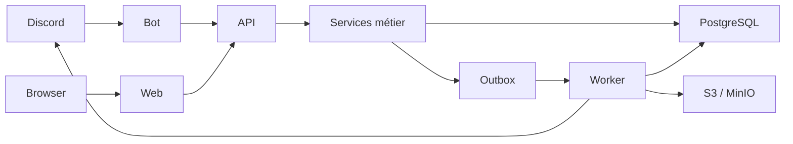

# Architecture technique

## Cible

## Responsabilités

- `apps/bot` : adaptateur Discord, rendu des composants, validation de contexte, aucune règle économique locale.
- `apps/web` : interface et actions autorisées; aucune identification par nom affiché.
- `apps/api` : authentification, autorisation, validation des entrées, orchestration et endpoints de santé.
- `apps/worker` : échéances, planification de boss, jobs d’import, traitement de l’outbox et reprises.
- `packages/game-engine` : calculs purs, déterministes et sans I/O.
- `packages/services` : transactions métier, idempotency, verrous et événements.
- `packages/database` : schéma, migrations, client et seeds.
- `packages/shared` : contrats, validation et primitives transverses.

## Règles de dépendance

Les adaptateurs dépendent du domaine; le domaine ne dépend ni de Discord, ni de Next.js, ni d’Express. Une mutation qui change des crédits, des objets, des cartes ou une progression passe par un service transactionnel unique.

## Cohérence et concurrence

- PostgreSQL est la source de vérité.
- Chaque commande externe possède une clé d’idempotence stable et un périmètre.
- Les lignes économiques critiques sont verrouillées ou mises à jour avec une condition de version/solde.
- Les événements sortants sont écrits dans la même transaction que la mutation.
- Les workers utilisent une prise de bail avec `locked_at`, `locked_by` et un nombre de tentatives.
- Les dates sont stockées en UTC; le fuseau de présentation est explicite.

## Déploiement

Les images API, bot, web et worker sont immuables et construites en CI. Les migrations sont un job séparé, exécuté avant le trafic applicatif seulement après sauvegarde vérifiée. Les services publient `live`, `ready` et une version de build.

## Observabilité

Chaque requête/interactions reçoit un `correlation_id`. Les logs JSON incluent service, version, guild, user pseudonymisé, commande, durée et résultat. Les métriques minimales couvrent taux d’erreur, latence, profondeur de jobs, échecs/reprises, conflits d’idempotence et débit économique.

## État de migration

L’architecture cible est additive. Les modèles historiques restent utilisables pendant la migration; leur écriture sera progressivement remplacée par les services transactionnels. Toute suppression de colonnes ou de données exige une migration distincte avec sauvegarde et plan de retour arrière.
